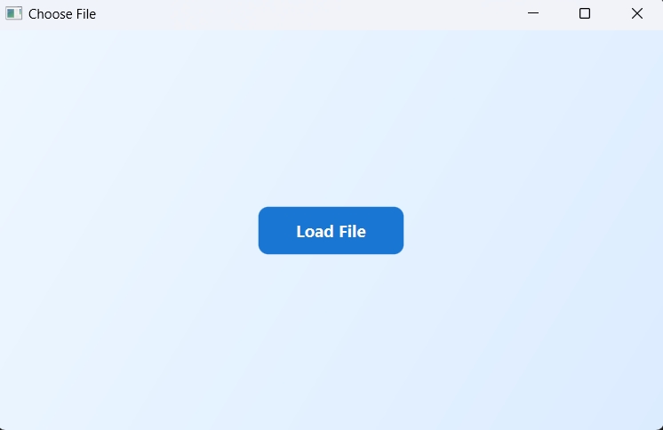
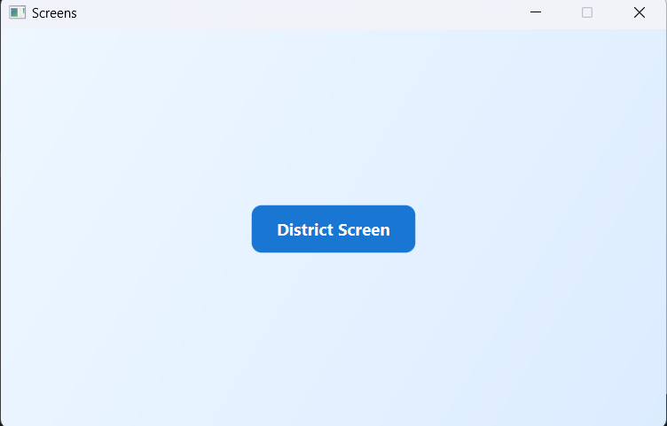
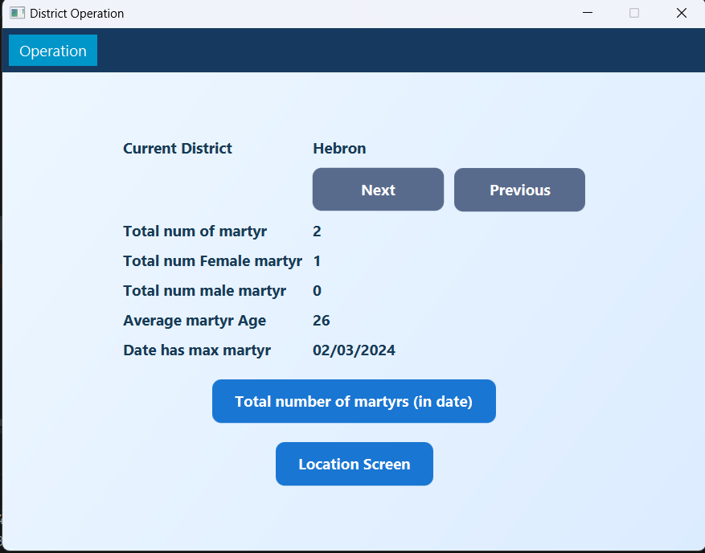
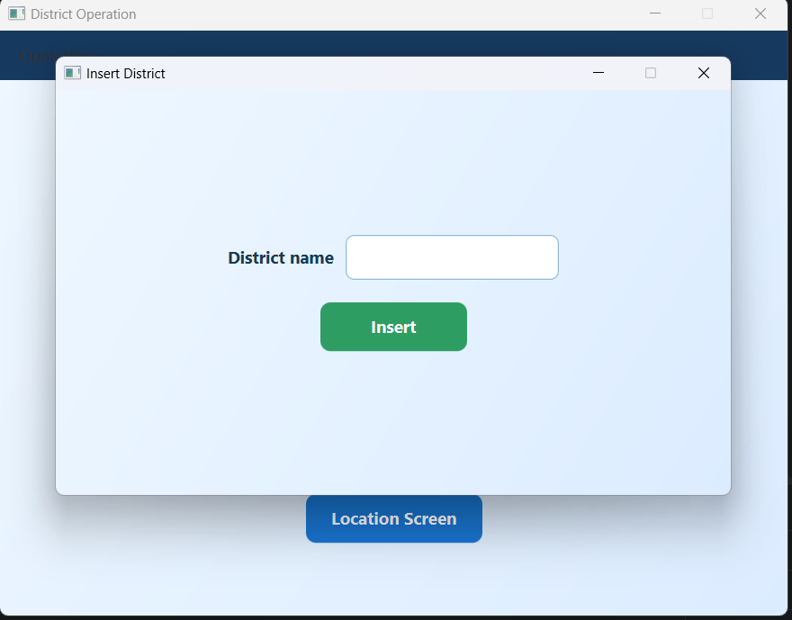
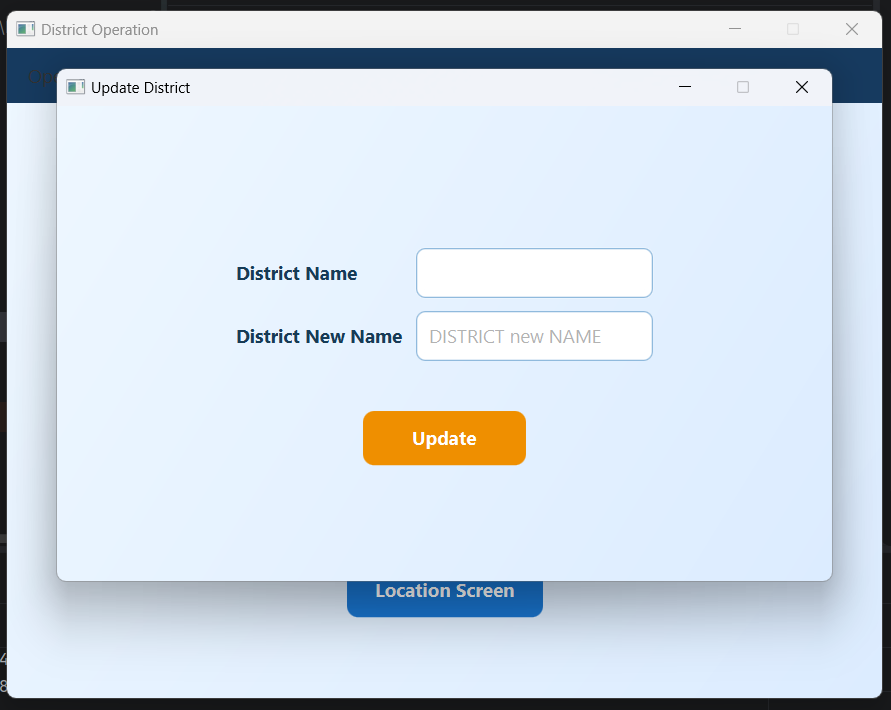
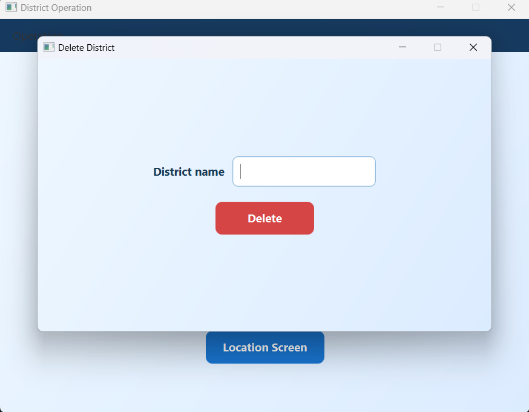

# Martyr Records Data Structure System

> A JavaFX desktop application that demonstrates custom linked data structures by organizing records across districts and locations.

**Java** | **JavaFX** | **Data Structures** | **Desktop Application**

The application loads records from a comma-separated file and provides a graphical interface for navigation, statistics, searching, insertion, updating, and deletion.

## Application Preview

### Load Data

The application starts with a file-selection screen. Users can load a compatible comma-separated data file from their computer.

<p align="center">
  
</p>

### District Navigation and Statistics

After loading a file, the user can open the district screen and browse district-level statistics.

<table>
  <tr>
    <td align="center"><strong>Main navigation</strong></td>
    <td align="center"><strong>District statistics</strong></td>
  </tr>
  <tr>
    <td></td>
    <td></td>
  </tr>
</table>

### District Operations

The operation menu provides separate interfaces for inserting, updating, and deleting districts. Action buttons use distinct colors to make each operation clear.

<table>
  <tr>
    <td align="center"><strong>Insert</strong></td>
    <td align="center"><strong>Update</strong></td>
    <td align="center"><strong>Delete</strong></td>
  </tr>
  <tr>
    <td></td>
    <td></td>
    <td></td>
  </tr>
</table>

## Features

- Load records from a comma-separated text file.
- Browse districts and their locations.
- View district and location statistics.
- Insert, update, and delete districts, locations, and martyr records.
- Search for a martyr using part of a name.
- Calculate totals and age statistics.
- Find the date with the highest number of records in a district.

## Data Structures

The project implements and uses custom linked data structures:

- A circular doubly linked list for districts.
- Circular linked lists for locations.
- Circular linked lists for martyr records.
- Sorted insertion for districts, locations, and records.
- Traversal, searching, insertion, updating, and deletion operations.

## Technologies

- Java
- JavaFX
- JavaFX inline CSS styling
- IntelliJ IDEA

## Input File Format

The application reads a comma-separated file through a JavaFX file chooser. No specific extension is enforced by the application, but `.csv` is recommended.

The input file **must not contain a header row**.

Each line must contain exactly these six fields:

```text
Name,Event Date,Age,Location,District,Gender
```

Requirements:

- The file must be comma-separated.
- Each record must be on a separate line.
- Each line must contain exactly six fields.
- Field values must not contain commas.
- `Age` must be a non-negative integer.
- `Gender` must be `M` or `F`, case-insensitive.
- The event date is stored as text and should use a consistent format.
- Date searches require the entered date to match the stored value.

Example:

```csv
Lina Haddad,01/15/2024,24,Ramallah City,Ramallah,F
Omar Khalil,01/15/2024,31,Al-Bireh,Ramallah,M
Maya Nasser,02/03/2024,19,Beitunia,Ramallah,F
```

## Sample Data

A ready-to-use file is available at [sample-data/sample-input.csv](sample-data/sample-input.csv).

All names and records in the sample file are synthetic.

> **Important:** The application may rewrite the selected file immediately after loading it and when records are changed. Test the application using a copy of the sample file if you want to preserve the original data.

## Project Structure

```text
phase1/
|-- docs/
|   `-- screenshots/
|       |-- DeleteScreen.png
|       |-- districtScreen.png
|       |-- insertScreen.png
|       |-- loadScreen.png
|       |-- mainScreen.png
|       `-- updateScreen.png
|-- sample-data/
|   `-- sample-input.csv
|-- MainClass.java
|-- DistrictList.java
|-- districtNode.java
|-- locationList.java
|-- locationNode.java
|-- martyrList.java
|-- MartyrNode.java
|-- phase1.iml
`-- README.md
```

All Java classes belong to the `application` package. In the current IntelliJ project configuration, the repository root is the source folder and uses `application` as its package prefix.

## Running in IntelliJ IDEA

### Prerequisites

- A compatible Java Development Kit (JDK).
- JavaFX SDK installed locally.
- IntelliJ IDEA.

### Project Setup

1. Open the `phase1` folder as an IntelliJ IDEA project.
2. Confirm that a JDK is selected under **File > Project Structure > Project**.
3. Add the JavaFX SDK libraries under **File > Project Structure > Libraries** if they are not already configured.
4. Create or open an Application run configuration.
5. Set the main class to:

```text
application.MainClass
```

6. Add these VM options:

```text
--enable-native-access=javafx.graphics --module-path "C:\javafx-sdk-26.0.1\lib" --add-modules javafx.controls,javafx.fxml
```

If JavaFX is installed in a different directory, replace the module path with the path to its `lib` folder.

7. Run the `MainClass` configuration.

## Testing with the Sample File

1. Create a copy of [`sample-data/sample-input.csv`](sample-data/sample-input.csv).
2. Start the application using `application.MainClass`.
3. Click **Load File**.
4. Select the copied sample CSV file.
5. Click **District Screen** to browse districts and statistics.
6. Open the location screen to inspect locations and perform record operations.

## Known Limitations

- The file chooser does not restrict the selectable file extension.
- Input lines are parsed using commas without CSV quoting support.
- Event dates are compared as text rather than parsed date values.
- User feedback is primarily printed to the console.
- The selected input file may be rewritten during application use.

## Author

Julia Duaibes
