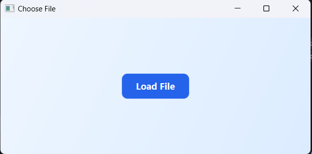
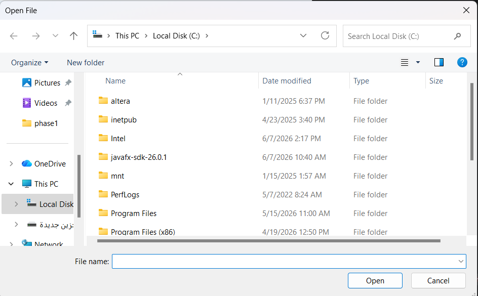
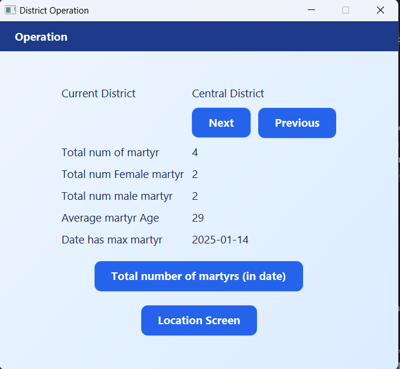
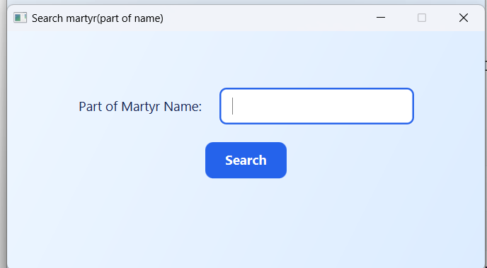
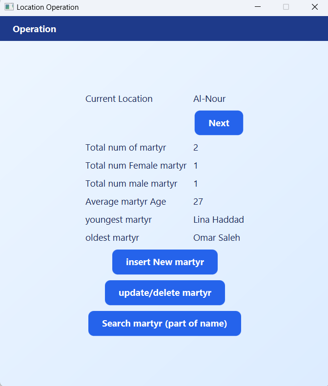

# Data Structure Project - Phase 2

## Overview
Phase 2 is a JavaFX desktop application for loading, organizing, and managing martyr records from a comma-separated input file. The application groups records by district and location and provides operations for insertion, update, deletion, navigation, searching, and statistical reporting.

## Features
- Load and parse records from a CSV file.
- Navigate through districts and locations.
- Insert, update, and delete martyr records.
- Search for records by date or name.
- Calculate and display statistics for locations and districts.

## Data Structures Used
- Circular singly linked lists for locations and martyr records
- A circular doubly linked list for districts
- Sorted insertion, traversal, and navigation mechanisms

## Technologies Used
- Java
- JavaFX
- JavaFX CSS

## Main Class
The main entry point of the application is:
`application.MainClass`

## Input File Format
The input file **must not contain a header row**. Each line must contain exactly these six values in this order:
`Name,Event,Age,Location,District,Gender`

**Constraints:**
- **Name**: Person's name (no commas).
- **Event**: Treated as a text/date string.
- **Age**: A non-negative integer.
- **Location**: Location name (no commas).
- **District**: District name (no commas).
- **Gender**: Must be `M` or `F`.

## Sample Data
A ready-to-use sample file is available at:
`sample-data/sample-input.csv`

## Running in IntelliJ IDEA
1. Open the project directory in IntelliJ IDEA.
2. Configure a compatible JDK and the JavaFX SDK.
3. Ensure the `application` directory is included in the module source configuration.
4. Create an Application run configuration and set the main class to `application.MainClass`.
5. Add these VM options:
`--enable-native-access=javafx.graphics --module-path "C:\javafx-sdk-26.0.1\lib" --add-modules javafx.controls,javafx.fxml`
6. Run the application.

## Screenshots

### Main Screen

### File Loaded

### Records View

### Search View

### Statistics View

## Author
Julia Duaibes
