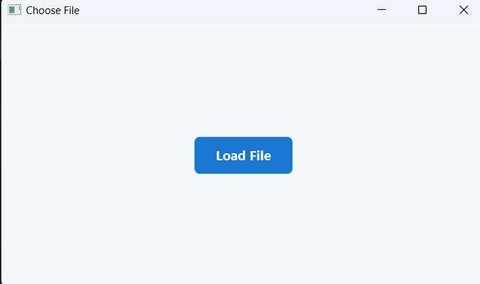

# Data Structure Project - Phase 3

## Overview

Phase 3 is a JavaFX desktop application for loading, organizing, navigating, searching, and updating records from a structured input file. The application groups records by district, location, and event date while demonstrating several core data structure concepts.

The main runnable class is:

```text
application.Main
```

## Application Screenshot



## Data Structures Used

- Binary Search Tree for districts, locations, and dates
- Circular linked list for records
- Stack for traversal
- Queue for level-order traversal

## Technologies

- Java
- JavaFX
- JavaFX CSS
- IntelliJ IDEA

## Input File Format

CSV is the recommended file extension, although the application does not enforce a specific extension in the file chooser.

The input file must **NOT** contain a header row.

Each line must contain exactly six comma-separated values in this order:

```text
Name,Event Date,Age,Location,District,Gender
```

### Input Constraints

- Values must be separated by commas.
- Event Date must use `M/d/yyyy` or `MM/dd/yyyy` format, for example `5/12/2023`.
- Age must be a non-negative integer.
- Gender must be `M` or `F`.
- Names, locations, and districts must not contain commas.
- Each record must be on a separate line.
- Each line should contain all six values.

Example:

```csv
Lina Haddad,5/12/2023,24,Ramallah City,Ramallah and Al-Bireh,F
Omar Khalil,5/12/2023,31,Ramallah City,Ramallah and Al-Bireh,M
Maya Nasser,6/18/2023,19,Al-Bireh,Ramallah and Al-Bireh,F
```

## Sample Data

A ready-to-use sample file is available at:

```text
sample-data/sample-input.csv
```

Loading a file may rewrite the selected file as part of the application's existing behavior. Test the application using a copy of the sample file if you want to preserve the original sample data.

## Running in IntelliJ IDEA

1. Open the project directory in IntelliJ IDEA.
2. Configure JDK 26 for the project.
3. Add the JavaFX SDK libraries from `C:\javafx-sdk-26.0.1\lib`.
4. Create an Application run configuration.
5. Set the main class to `application.Main`.
6. Add the following VM options:

```text
--enable-native-access=javafx.graphics --module-path "C:\javafx-sdk-26.0.1\lib" --add-modules javafx.controls,javafx.fxml
```

7. Run the application.

## Testing with the Sample File

1. Start the application using `application.Main`.
2. Click **Load File**.
3. Select `sample-data/sample-input.csv`, or preferably a copy of it.
4. Use the district, location, and record screens to navigate and manage the loaded data.

## Project Structure

```text
phase3/
|-- application/
|   |-- Main.java
|   |-- mainClass.java
|   |-- application.css
|   |-- districtTree.java
|   |-- districtNode.java
|   |-- locationTree.java
|   |-- locationNode.java
|   |-- datesTree.java
|   |-- datesTreeNode.java
|   |-- martyrList.java
|   |-- martyrNode.java
|   `-- stack.java
|-- sample-data/
|   `-- sample-input.csv
|-- docs/
|   `-- screenshots/
|       `-- load-file-screen.png
|-- phase3.iml
`-- README.md
```

## Author

Julia Duaibes
