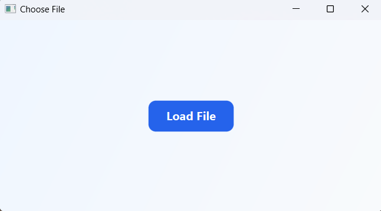
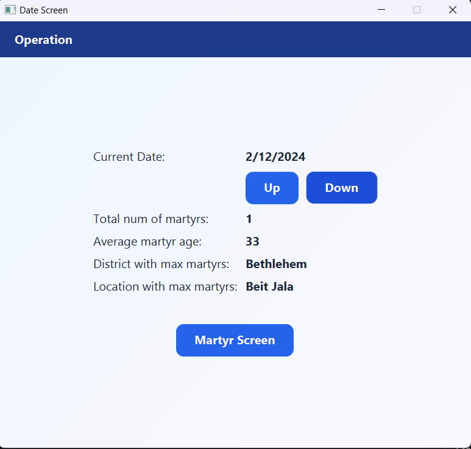
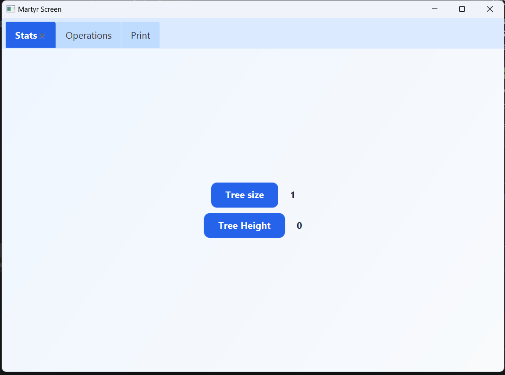
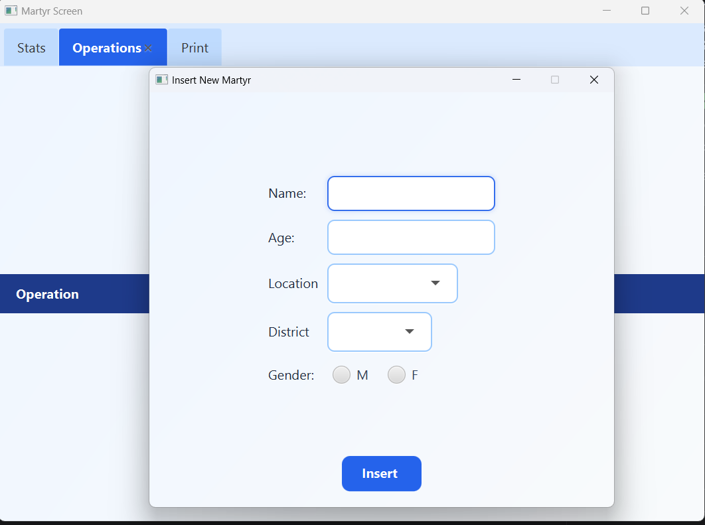
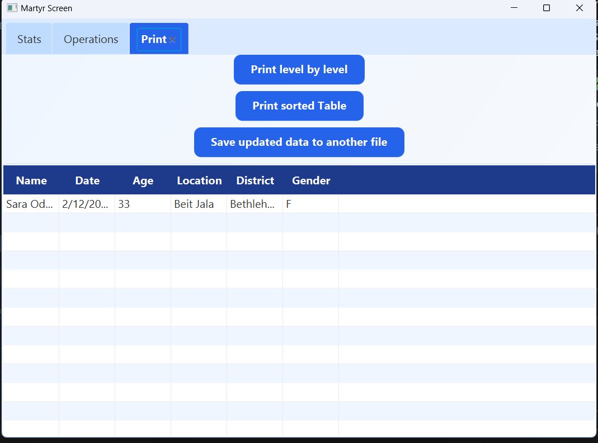

# Data Structure Project - Phase 4

Phase 4 is a Java and JavaFX desktop application for loading, organizing, viewing, and updating event records from a comma-separated input file. It demonstrates several core data structure concepts through a graphical user interface.

## Data Structures Used

- Hash table
- Quadratic probing
- Rehashing
- AVL tree
- Min heap / heap sort

The hash table organizes records by event date. Each date stores its records in an AVL tree, while a min heap supports age-based sorting.

## Technologies

- Java
- JavaFX
- JavaFX CSS
- IntelliJ IDEA

## Input File Format

The application reads a plain-text, comma-separated file. A `.csv` extension is recommended, although the application does not enforce a particular extension.

The input file must **not contain a header row**.

Each line must contain exactly six values in this order:

```text
Name,Event Date,Age,Location,District,Gender
```

Input rules:

- Values must be separated by commas.
- Every line must contain exactly six values.
- Event Date must use the `M/d/yyyy` format, for example `5/14/2023`.
- Age must be a non-negative integer.
- Gender must be `M` or `F`.
- Names should be unique within each date.
- Values must not contain commas.

Example:

```csv
Lina Khalil,5/14/2023,24,Ramallah City,Ramallah,F
Omar Nasser,5/14/2023,31,Al-Bireh,Ramallah,M
Yousef Hamdan,7/8/2023,42,Nablus City,Nablus,M
```

## Sample Data

A ready-to-use sample input file is available at:

```text
sample-data/sample-input.csv
```

The selected input file may be rewritten when the application performs update operations. Test the application using a copy of the sample file if you want to preserve the original sample data.

## Running in IntelliJ IDEA

1. Open the `phase4` directory as a project in IntelliJ IDEA.
2. Configure the project SDK with a compatible Java Development Kit.
3. Add the JavaFX SDK libraries to the project.
4. Create an Application run configuration.
5. Set the main runnable class to:

   ```text
   application.mainclass
   ```

6. Add these VM options, updating the JavaFX path if it is installed elsewhere:

   ```text
   --enable-native-access=javafx.graphics --module-path "C:\javafx-sdk-26.0.1\lib" --add-modules javafx.controls,javafx.fxml
   ```

7. Run the configuration.

## Testing with the Sample File

1. Start the application using `application.mainclass`.
2. Click **Load File**.
3. Browse to `sample-data/sample-input.csv`, or preferably a copy of that file.
4. Select the file and open it.
5. Use the date and record screens to navigate, view statistics, insert, update, delete, and sort records.

Console output is used by some operations to display results and status messages.

## Application Screenshots

### Load an Input File



### Date Statistics

The date screen displays the current event date, record count, average age, and the districts and locations with the most records.



### AVL Tree Statistics

The Stats tab shows information about the AVL tree associated with the selected date.



### Record Operations

The Operations tab provides forms for inserting and managing records.



### Print and Table View

The Print tab supports level-by-level traversal, heap-based sorting, exporting updated data, and displaying records in a table.



## Project Structure

```text
phase4/
|-- application/
|   |-- mainclass.java
|   |-- HashTable.java
|   |-- hashNode.java
|   |-- MartyrsAVLTree.java
|   |-- martyrNode.java
|   |-- MinHeap.java
|   `-- application.css
|-- docs/
|   `-- screenshots/
|       |-- DateScreen.png
|       |-- loaded-file.png
|       |-- MartyrScreenTree.png
|       |-- opertation.png
|       `-- status.png
|-- sample-data/
|   `-- sample-input.csv
|-- README.md
`-- phase4.iml
```

## Author

Julia Duaibes
